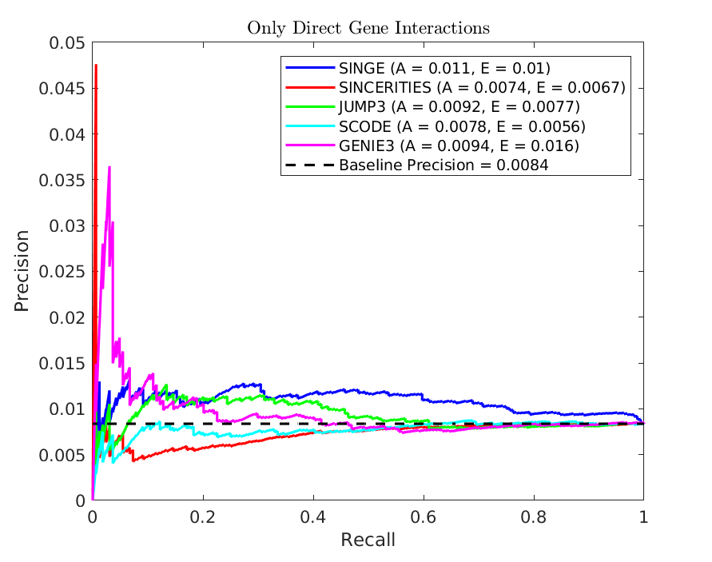
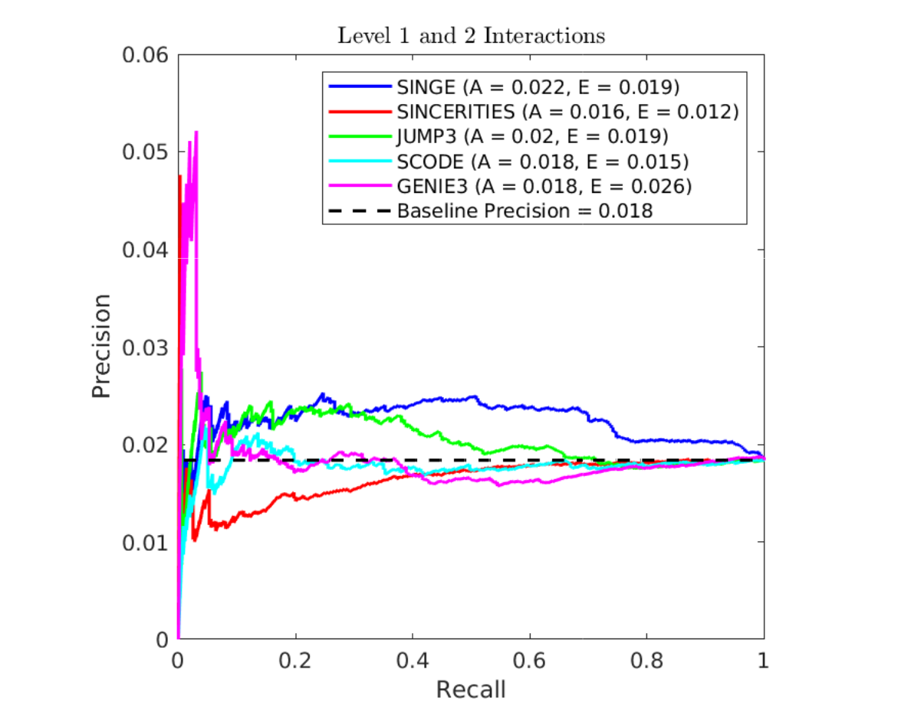
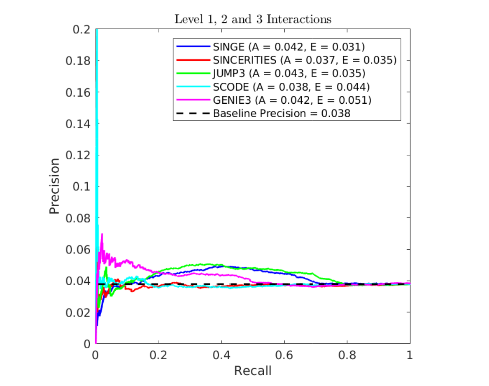
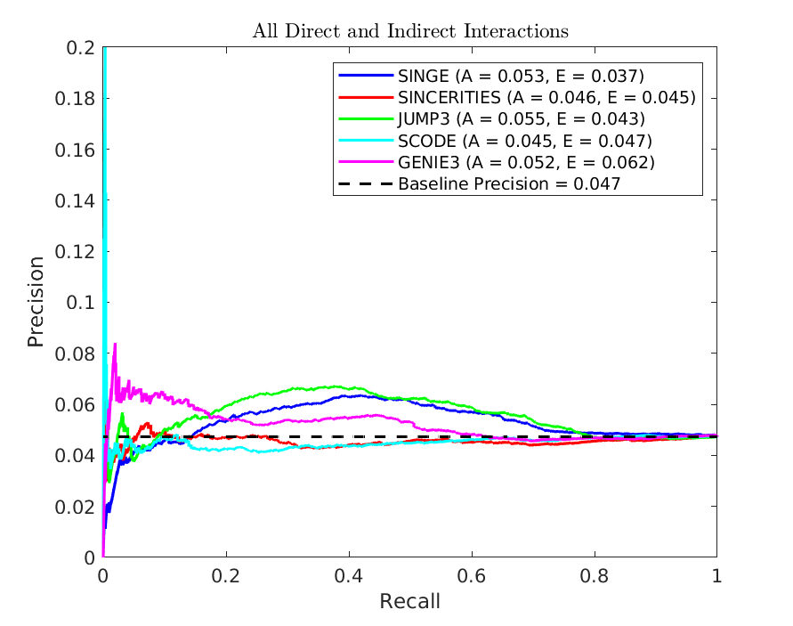
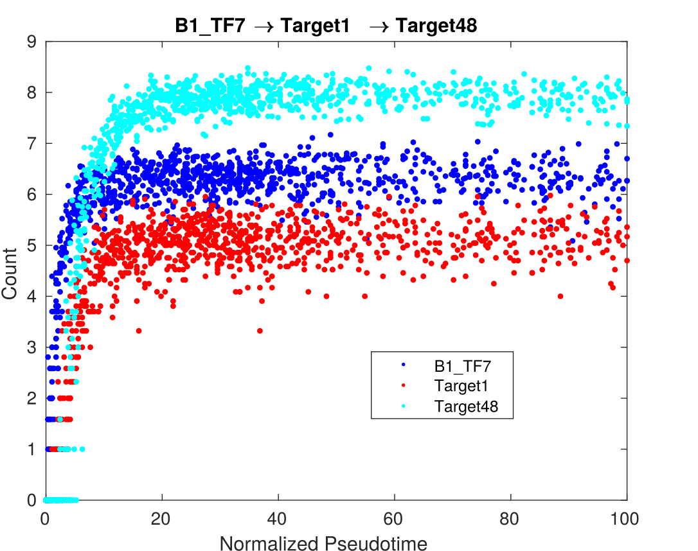

We generated a simulated dataset using [dyngen](https://github.com/dynverse/dyngen), with the help of the script `generate_dataset.R`.
This was modified from one provided by [@rcannood](https://github.com/rcannood).
The datset includes 25 TFs, 15 housekeeping genes, and 100 target genes, with 164 total edges.
This dataset is saved in `data/X_Dyngen.mat`.

## SINGE analysis on the dyngen dataset
We run SINGE on `X_Dyngen.mat` using the command

`bash SINGE.sh PATH_TO_RUNTIME standalone data/X_Dyngen.mat data/gene_list.mat Output default_hyperparameters.txt`

For more detailed notes on SINGE command and usage, please refer to https://github.com/gitter-lab/SINGE/

## Results
The figures below show the precision-recall performance of inferred networks from SINGE, SCODE, Jump3, SINCERITIES, and GENIE3 with respect to the truth provided by the dyngen model. These figures show that the performance of SINGE improves when evaluating with respect to a gold standard representing both direct and indirect interactions between genes.

The final figure compares the expression trends of an example direct and "indirect" edge.
Based on expression trends alone, it is difficult for these methods to distinguish direct from indirect edges in the dyngen dataset.

### Precision-recall performance with direct gene interactions
Here, the truth corresponds to only the direct regulatory interactions between genes. No indirect interactions are considered.

### Precision-recall performance with direct and Level 1 indirect gene interactions
Here, the truth includes the direct regulatory interactions as well as Level 1 indirect interactions between genes. A Level 1 indirect interaction is a directed path with length 2: A → B → C.

### Precision-recall performance with direct and Level 2 indirect gene interactions
The truth now includes the direct regulatory interactions as well as Level 1 and Level 2 indirect interactions between genes. A Level 2 indirect interaction is a directed path with length 3.

### Precision-recall performance with all direct and indirect gene interactions
The truth here includes the direct regulatory interactions as well as all indirect interactions between genes caused through the direct interactions. 

### Expression trends of genes with direct and indirect interactions
The figure shows the expression trends of three genes and illustrates how the expression trend alone is insufficient for most methods to distinguish between direct and indirect edges on the dyngen dataset.
Both the direct target (Target1) and indirect target (Target48) increase in expression soon after the regulator (B1_TF7).

